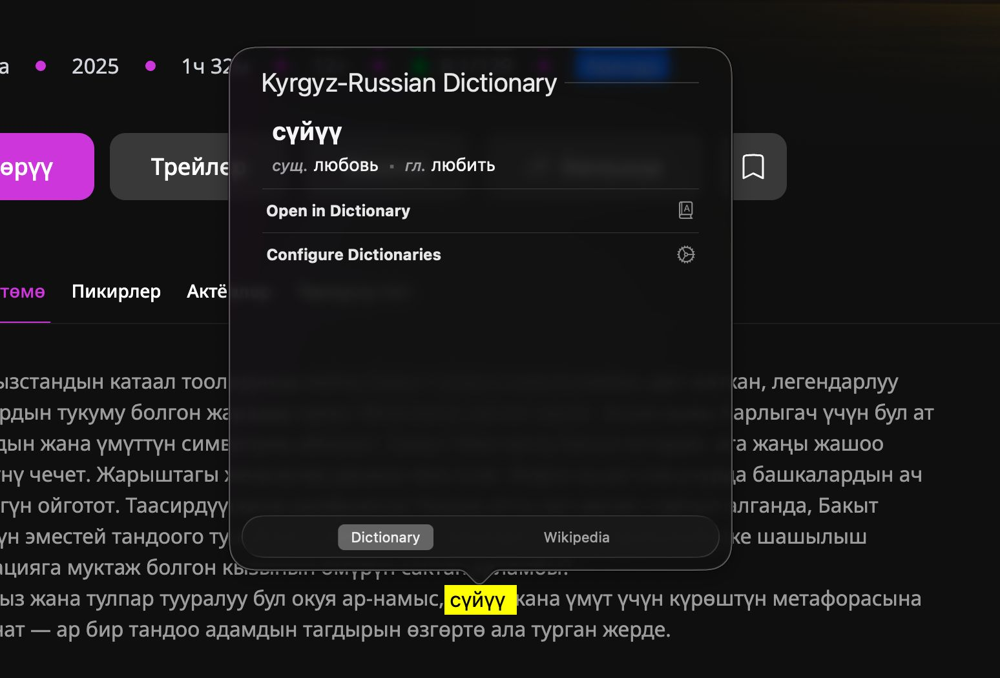

# Кыргызские словари для macOS

[README in English](README.md) · [README кыргызча](README_KY.md)

  

Четыре словаря для macOS Dictionary.app, собранные из открытых данных:

| Словарь | Статей | Описание |
|---|---|---|
| Русско-кыргызский | 21 000+ | Полные таблицы морфологии, правила гармонии гласных |
| Кыргызско-русский | 21 000+ | Обратный поиск по тем же данным |
| Англо-кыргызский | 8 800+ | С произношением, этимологией, частотностью |
| Кыргызско-английский | 8 800+ | Обратный поиск с кыргызскими леммами |

Возможности:
- Поиск по любой словоформе (набери «китептин» — найдёшь «китеп», «билдирет» — «билдирүү»)
- Таблицы склонения существительных (6 падежей x ед./мн.)
- Формы спряжения глаголов индексированы для поиска
- Умная группировка переводов: дедупликация видовых пар, родовых форм; ранжирование по количеству источников
- Объяснение правил выбора суффиксов
- Этимология и произношение из Wiktionary
- Частотность из корпуса Manas-UdS
- Примеры из параллельного корпуса GoURMET
- Тёмная тема

## Установка

1. Скачайте нужный словарь из [Releases](../../releases/latest)
2. Распакуйте
3. Скопируйте `.dictionary` в `~/Library/Dictionaries/`
   > **Совет:** Эту папку можно открыть прямо из Dictionary.app → Файл → Открыть папку «Словари»
4. Откройте Dictionary.app → Настройки → Включите словарь

## Документация

- [Сборка из исходников](docs/BUILDING.md)
- [Пайплайн данных](docs/PIPELINE.md)
- [Участие в проекте](docs/CONTRIBUTING.md)

## Источники данных

| Источник | Лицензия |
|----------|----------|
| [English Wiktionary](https://en.wiktionary.org/) via [kaikki.org](https://kaikki.org/) | CC BY-SA |
| [Russian Wiktionary](https://ru.wiktionary.org/) via [kaikki.org](https://kaikki.org/) | CC BY-SA |
| [Apertium-kir](https://github.com/apertium/apertium-kir) | GPL-3.0 (только факты) |
| [GoURMET](https://opus.nlpl.eu/GoURMET.php) параллельный корпус ky-ru | Open (OPUS) |
| [OpenRussian.org](https://github.com/Badestrand/russian-dictionary) | CC BY-SA 4.0 |
| [Manas-UdS Kyrgyz Corpus](https://fedora.clarin-d.uni-saarland.de/kyrgyz/) | CC BY-NC-SA 4.0 |

## Благодарности

Исследование данных, архитектура пайплайна и код разработаны при помощи [Claude](https://claude.ai) (Anthropic).

## Лицензия

CC BY-NC-SA 4.0 (требуется корпусом Manas-UdS). См. [LICENSE](LICENSE).
